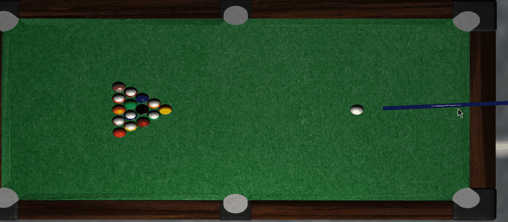
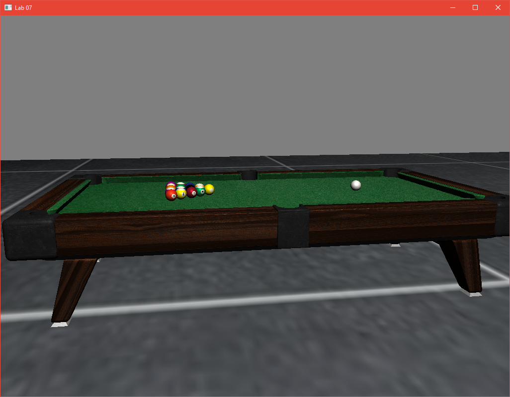
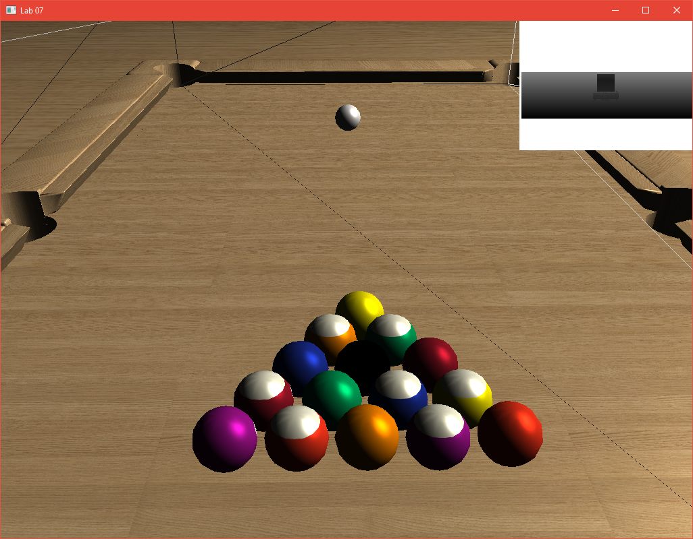
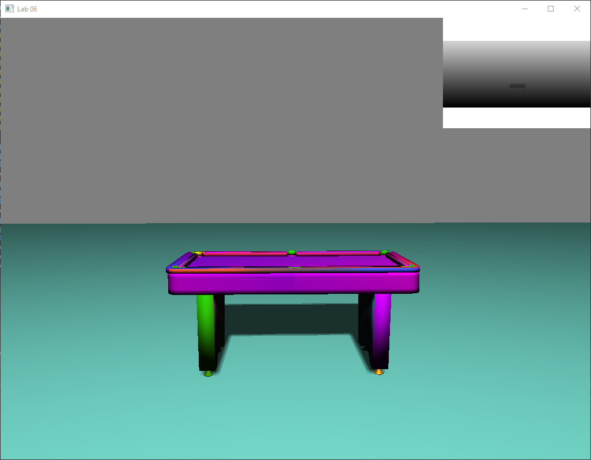

# 3D Physics-based Billiards Simulation

A complete, real-time 3D simulation of a local 2-player billiards game, featuring a custom physics engine and rendering pipeline. Developed using **C++** and **OpenGL**, with **GLSL** for programmable shaders.

---

## 📸 Demo & Screenshots

Here is a look at the final simulation:

### Physics & Collision Detection

*Demonstrating real-time, sphere-to-sphere collision detection and momentum transfer algorithm implemented in the custom physics engine.*

### Final Render

*Showcasing the final look of the game.*

### Textures

*Showcasing custom GLSL fragment shaders for per-pixel lighting, specular reflections, and realistic textures.*

### First Screeshot

*The first screenshot of the project.*

---

## 🚀 Key Technical Features

* **Custom Physics Engine:** Developed a full-physics simulation from scratch, handling realistic ball-to-ball and ball-to-cushion collisions, frictionless rotation, and momentum conservation.
* **Programmable GPU Pipeline:** Wrote custom **GLSL vertex and fragment shaders**. Implemented a lighting model to render realistic materials and shadows.
* **Game Logic & Ruleset:** Implemented a full **local 2-player mode** including a standard ruleset (e.g., for 8-ball). Handles foul detection, turn management, ball potting logic, and player scoring.
* **Build System:** Project is managed with **CMake** for seamless cross-platform compilation and dependency handling.

---

## 🛠️ Tech Stack

* **Programming Languages:** C++, GLSL
* **Graphics API:** OpenGL
* **Libraries:** GLFW (Window & Input), GLEW/Glad (OpenGL Loading), GLM (Mathematics)
* **Build Tool:** CMake

---

## 🧑‍💻 Author

* **Vasileios Andreikos**
* Electrical & Computer Engineering Student | University of Patras
* [GitHub Profile](https://github.com/vasilis-andreikos)
* [LinkedIn Profile](https://www.linkedin.com/in/vasileios-andreikos-7953433b7/)

---

## 📜 Report

A detailed analysis of the algorithms and implementation details is available in the [Project Report (in Greek)](Report_Greek.pdf).